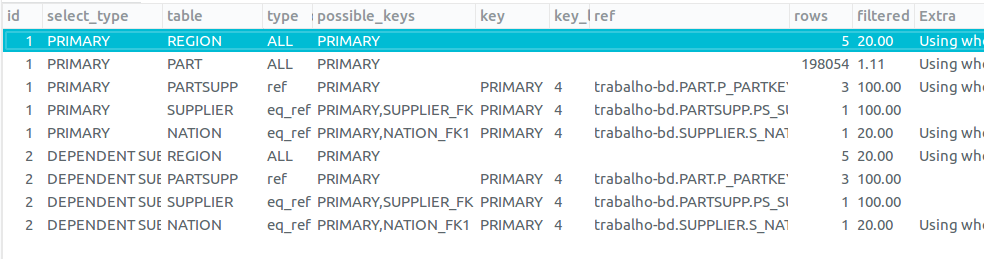
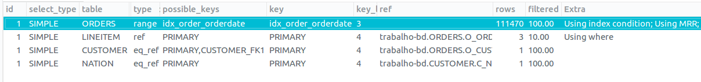
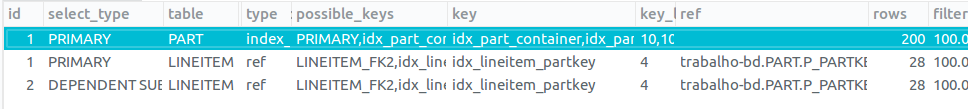

# Q1

> Verificamos que neste caso o uso de índice não ajudou muito.
> A adição de um possível índice inclusive aumentou o tempo da consulta e o _QUERY COST_

```sql

create index idx_lineitem_shipdate on LINEITEM(l_shipdate);

```

- **Execution plain sem índice**


- **Execution Plan com índice criado**


> **Tempo sem índice:** 17s

> **Tempo com índice:** 22,8s

---

# Q2

> Nesta consulta o tempo da consulta já estava bem pequeno. 
> mas ainda sim era realizado um _FULL SCAN_ na tabela **PART** 
> Logo, resolvemos criar o seguinte índice (que diminuiu bastante o _QUERY COST_): 

```sql

create index idx_part_join on PART(p_partkey p_size);

```
> Depois ainda criamos o seguinte índice(que também melhorou um pouco mais o tempo de execução e o _QUERY COST_): 

```sql

create index idx_partsupp_supplycost on PARTSUPP(ps_supplycost);

```

> Poderia ser criado também o índice:

```sql

create index idx_region_name on REGION(r_name);

```

> Mas pelo fato da tabela **REGION** ter poucos registros a vantagem não seria tão grande

- **Execution plain sem índice**




- **Execution Plan com índice criado**


> **Tempo sem índice:** 0,17s

> **Tempo com índice:** 0,04s

---

# Q3

> Pelo fato da tabela **ORDERS** não ter nenhum índice, o óbvio foi criar o seguinte índice:

```sql
create index idx_order_conditions on ORDERS(o_custkey, o_orderkey, o_orderdate);

```

>Ele diminuiu o _QUERY COST_  mas não houve melhora no tempo. 
>Em alguns casos a consulta sem índice chegou a rodar mais rápido


- **Execution plain sem índice**


- **Execution Plan com índice criado**


> **Tempo sem índice:** De 3,9s a 6s

> **Tempo com índice:** 4,9s

---

# Q4

> Novamente uma consulta na tabela **ORDERS**
> Pelo fato de não possuir índices, escolhemos o seguinte:
```sql

create index idx_order_orderdate on ORDERS(o_orderdate);

```

> O índice diminuiu o _QUERY COST_ e também o tempo da consulta


- **Execution plain sem índice**


- **Execution Plan com índice criado**


> **Tempo sem índice:** 2,5s

> **Tempo com índice:** 1,5s

---

# Q5

> Esta é mais uma consulta que usa a tabela **ORDERS** que não possui nenhum índice.
> A solução mais significativa foi colocar um indice nos campos de **ORDERS** que foram usados no **WHERE**
> Assim conseguimos diminuir o tempo da consulta e também o _QUERY COST_, pois deixamos de fazer um _FULL SCAN_
> na tabela **ORDERS**
> Desta forma:

```sql

create index idx_order_conditions on ORDERS(o_custkey, o_orderkey, o_orderdate);

```


- **Execution plain sem índice**


- **Execution Plan com índice criado**


> **Tempo sem índice:** 3s

> **Tempo com índice:** 1,5s

---

# Q6

> Nesta consulta não houve nenhum índice que fosse capaz de diminuir o _QUERY COST_
> No entanto, criamos o seguinte índice:

```sql
create index idx_lineitem_conditions on LINEITEM(l_shipdate, l_discount, l_quantity);
```

> Apesar desse índice ter mantido o custo igual, o tempo da consulta diminuiu


- **Execution plain sem índice**


- **Execution Plan com índice criado**


> **Tempo sem índice:** 3s

> **Tempo com índice:** 1,65s

---

# Q7

> Verificamos que a tabela **ORDERS** não possuia nenhum índice criado.
> com isso foi criado o seguinte índice: 

```sql
create index idx_order_join on ORDERS(o_custkey, o_orderkey);
```

> Que mostrou-se eficiente, reduzindo o custo da query em quase 80%


- **Execution Plan**


- **Execution Plan com índice criado**


> **Tempo sem índice:** 14s - 17s

> **Tempo com índice:** 2,6 - 3,6s

---

# Q8

> Mais uma vez a tabela **ORDERS** é a principal responsavel pelo tempo da consulta.
> O fato da tabela não possuir nenhum índice aumenta muito o tempo da consulta pois é preciso fazer um _FULL SCAN_
> A simples adicão de um indice usando as mesma colunas usadas nas condições de junção, já diminuiu bastante o tempo.
> No entanto, adicionamos também um índice na tabela **PART** que diminuiu mais um pouco o tempo.
> Os seguintes índices foram adicionados:

```sql
create index idx_order_conditions on ORDERS(o_custkey, o_orderkey, o_orderdate);
create index idx_part_type on PART(p_type);

```


- **Execution plain sem índice**


- **Execution Plan com índice criado**


> **Tempo sem índice:** 6s

> **Tempo com índice:** 2,6s

---

# Q9

> A consulta não rodou em menos de 60 segundos (deu TIMEOUT)
> Pelo fato da tabela **ORDERS** não possuir nenhum índice criado.
> A consulta tornava-se muito custosa 
> com isso foi criado o seguinte índice: 

```sql
create index idx_order_orderkey on ORDERS(o_orderkey)

```

> **Explain**


- **Execution Plan com índice criado**


> **Tempo sem índice:** Deu _Timeout_ (mais de 60s)

> **Tempo com índice:** 12,6s
---

# Q10


> Como já vimos, a tabela **ORDERS** não possui nenhum índice criado.
> com isso foi criado o seguinte índice: 

```sql
create index idx_order_orderdate on ORDERS(o_orderdate);

```

> Desta forma o SGBG consegue fazer um _RANGE SCAN_ nesta consulta, conforme mostrado no _EXECUTION PLAN_

- **Execution Plan**


- **Execution Plan com índice criado**





> **Tempo sem índice:** De 2,9s a 4,4s

> **Tempo com índice:** De 2s a 2,2s

---


# Q11


> Verificamos que a tabela **PARTSUPP** não possuia um indice separado para o campo _PS_SUPPKEY_
> com isso foi criado o seguinte índice:

```sql

create index idx_partsupp_suppkey on PARTSUPP(ps_suppkey);

```

> Com isso conseguimos diminuir tanto o _QUERY COST_ quanto o tempo da consulta

- **Execution Plan sem índice**


- **Execution Plan com índice criado**


> **Tempo sem índice:** De 2,4s a 3,1s

> **Tempo com índice:** 0,6s
---


# Q12


> Mais uma vez a tabela  **ORDERS** que não possui nenhum indice criado
> está sendo usado em uma condição de junção
> com isso foi criado o seguinte índice:

```sql

create index idx_order_orderkey on ORDERS(o_orderkey);

```
> Ele foi suficiente para diminuir bastante o tempo da consulta e o _QUERY COST_


- **Execution Plan sem índice**


- **Execution Plan com índice criado**


> **Tempo sem índice:** De 11,5 a 15s

> **Tempo com índice:** 3,8s

---

# Q13

> Esta consulta também deu _TIMEOUT_
> A razão disso foi que mais uma vez a tabela **ORDERS** foi usada numa junção
> com isso foi criado o seguinte índice: 

```sql

create index idx_order_custkey on ORDERS(o_custkey);

```

> Apenas isso foi suficiente para fazer a consulta rodar

- **Explain sem índice**


- **Execution Plan com índice criado**


> **Tempo sem índice:** Deu _Timeout_ (mais de 60s)

> **Tempo com índice:** 14,4s

---

# Q14


> Verificamos que poderíamos adicionar um índice para que o SGBD
> deixasse de fazer um _FULL SCAN_ na tabela **LINEITEM**
> Com isso criamos o seguinte índice:

```sql

create index idx_lineitem_conditions on LINEITEM(l_shipdate, l_partkey);

```

- **Execution plain sem índice**


- **Execution Plan com índice criado**


> **Tempo sem índice:** 5,6s

> **Tempo com índice:** 1,2s

---

# Q15


> Da mesma forma que a consulta 14, o objetivo aqui foi criar um índice
> que fosse capaz de trocar o _FULL SCAN_ por _RANGE SCAN_
> Desta forma, criamos o seguinte índice:

```sql

create index idx_lineitem_shipdate on LINEITEM(l_shipdate);

```

- **Execution plain sem índice**


- **Execution Plan com índice criado**


> **Tempo sem índice:** 6,4s

> **Tempo com índice:** 5,8s

---

# Q16


> Verificamos que neste caso o uso de índice não ajudou muito.
> Os índices diminuiram um pouco o _query cost_ 
> A diferença de tempo entre as consultas foi insignificante. 
> Os indices criados foram os seguintes: 

```sql

create index idx_part_size on PART(p_size);
create index idx_part_brand on PART(p_brand);

```

> Sendo o primeiro o mais relevante por possibilitar um Range Scan como mostrado no _Execution Plan_

- **Execution plain sem índice**


- **Execution Plan com índice criado**


> **Tempo sem índice:** 0,6s

> **Tempo com índice:** 0,6s

---

# Q17


> Verificamos que a maior parte do custo nesta consulta deve-se a tabela **PART**
> Com isso criamos os seguintes índices:

```sql

create index idx_part_container on PART(p_container);
create index idx_part_brand on PART(p_brand);
create index idx_lineitem_partkey on LINEITEM(l_partkey);

```

> O custo diminuiu bastante com a criação dos índices para a tabela **PART**.
> No entanto, o índice criado para a tabela **LINEITEM** não teve muito impacto, mas conseguiu diminuir minimamente o custo.


- **Execution plain sem índice**


- **Execution Plan com índice criado**





> **Tempo sem índice:** 2,2s

> **Tempo com índice:** 1,3s

---

# Q18

> Neste caso o uso de índice não ajudou muito.
> O tempo teve uma pequena variação, mas olhando para o _EXECUTION PLAN_
> Vemos que não houve diferença no _QUERY COST_
> O SGBD apenas escolheu usar o índice criado:

```sql

create index idx_lineitem_conditions on LINEITEM(l_orderkey, l_quantity);

```

- **Execution plain sem índice**


- **Execution Plan com índice criado**


> **Tempo sem índice:** 4,7s

> **Tempo com índice:**  3,8s

---

# Q19

> Neste caso o objetivo foi tentar remover o _FULL SCAN_ que estava sendo feito
> Com isso adicionamos o seguinte índice:

```sql

create index idx_part_conditions on PART(p_container, p_brand, p_size, p_partkey);

```

> O tempo de execução não mudou muito, pois já era pouco antes da criação do índice
> No entanto, após a criação o SGBD conseguiu fazer um _RANGE SCAN_

- **Execution plain sem índice**


- **Execution Plan com índice criado**


> **Tempo sem índice:** 0,3s

> **Tempo com índice:** 0,2s

---

# Q20


> Verificamos o SGBD estava fazendo um _FULL SCAN_ na tabela **PART**
> Com isso decidimos criar o seguinte índice:

```sql

create index idx_part_name on PART(p_name);

```

> Após a criação do índice não houve mudança significativa no tempo da consulta, mas o _QUERY COST_ diminuiu bastante

- **Execution plain sem índice**


- **Execution Plan com índice criado**


> **Tempo sem índice:** 1,2s

> **Tempo com índice:** 1,1s

---

# Q21


```sql
create index idx_nation_name on NATION(n_name);

```
- **Execution plain sem índice**


- **Execution Plan com índice criado**


> **Tempo sem índice:** 24,8s

> **Tempo com índice:** 23,7s

---

# Q22


> Mais uma consulta que deu _TIMEOUT_
> A razão disso está no fato da tabela **ORDERS** não possuir nenhum índice


```sql
create index idx_order_custkey on ORDERS(o_custkey);
create index idx_customer_join on CUSTOMER(c_acctbal, c_phone);

```
- **Explain sem índice**


- **Execution Plan com índice criado**


> **Tempo sem índice:** Deu _Timeout_ (mais de 60s)

> **Tempo com índice:** 0,26s

---